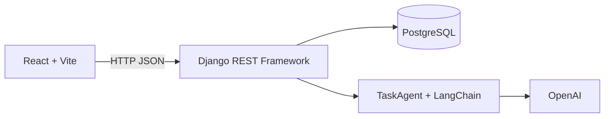

# TaskPilot AI

MVP fullstack para una prueba técnica: permite crear, listar, filtrar y completar tareas. Un agente construido con LangChain clasifica cada tarea y propone subtareas usando un modelo de OpenAI.

## Arquitectura



La lógica de IA está en `backend/tasks/services/agent.py`, separada de la vista HTTP. Esto permite cambiar el proveedor y probar el servicio con un objeto simulado sin llamar a una API real.

## Equivalencias con Laravel

| Laravel | Django / DRF | Archivo del proyecto |
| --- | --- | --- |
| Modelo Eloquent | Django Model | `backend/tasks/models.py` |
| Migration | Django Migration | `backend/tasks/migrations/0001_initial.py` |
| Form Request + Resource | Serializer | `backend/tasks/serializers.py` |
| API Controller | ViewSet | `backend/tasks/views.py` |
| `routes/api.php` | Router + `urls.py` | `backend/tasks/urls.py` |
| Service | Clase de servicio | `backend/tasks/services/agent.py` |
| PHPUnit | pytest | `backend/tasks/tests/` |
| Artisan | `manage.py` | `backend/manage.py` |

## Requisitos

- Windows con WSL 2.
- Docker Desktop ejecutándose con el motor WSL2.
- Una API key de OpenAI solo si se quiere probar el LLM real.

No es necesario instalar Python, PostgreSQL ni Node en Windows: las imágenes Docker contienen esas dependencias.

## Primer inicio en Windows

Descomprime el proyecto, abre la carpeta en VS Code y luego abre PowerShell en esa carpeta.

1. Crea el archivo local de variables:

   ```powershell
   Copy-Item .env.example .env
   ```

2. Para practicar sin una API key, abre `.env` y cambia:

   ```dotenv
   AI_FAKE_MODE=true
   ```

   Este modo devuelve datos de demostración. La integración real sigue implementada y las pruebas no dependen de Internet.

3. Construye y levanta los tres servicios:

   ```powershell
   docker compose up --build
   ```

4. Abre:

   - Frontend: <http://localhost:5173>
   - API: <http://localhost:8000/api/tasks/>

5. En otra ventana de PowerShell ejecuta las pruebas:

   ```powershell
   docker compose exec backend pytest
   docker compose exec frontend npm test
   ```

6. Detén el proyecto con `Ctrl+C` y luego:

   ```powershell
   docker compose down
   ```

`docker compose down` conserva los datos. `docker compose down -v` también elimina el volumen de PostgreSQL y, por lo tanto, las tareas guardadas.

## Usar OpenAI realmente

En `.env` configura:

```dotenv
OPENAI_API_KEY=tu_api_key
OPENAI_MODEL=gpt-5-mini
AI_FAKE_MODE=false
```

Nunca subas `.env` a Git. La cuenta de API y su facturación son independientes de una suscripción personal de ChatGPT.

El servicio utiliza salida estructurada con Pydantic. El agente debe devolver exactamente una categoría válida y entre 2 y 5 subtareas, lo que evita analizar manualmente texto libre.

## API REST

| Método | Ruta | Función |
| --- | --- | --- |
| `GET` | `/api/tasks/` | Listar tareas |
| `GET` | `/api/tasks/?status=pending` | Filtrar pendientes |
| `POST` | `/api/tasks/` | Crear una tarea |
| `PATCH` | `/api/tasks/{id}/` | Actualizar estado o contenido |
| `DELETE` | `/api/tasks/{id}/` | Eliminar una tarea |
| `POST` | `/api/tasks/{id}/analyze/` | Clasificar y sugerir subtareas |

Ejemplo de creación desde PowerShell:

```powershell
$body = @{
  title = "Preparar entrevista"
  description = "Repasar Django, Docker y LangChain"
} | ConvertTo-Json

Invoke-RestMethod `
  -Method Post `
  -Uri http://localhost:8000/api/tasks/ `
  -ContentType "application/json" `
  -Body $body
```

## Comandos que debes conocer

```powershell
# Construir y levantar todo
docker compose up --build

# Ver contenedores y estado
docker compose ps

# Ver logs del backend
docker compose logs -f backend

# Ejecutar migraciones manualmente
docker compose exec backend python manage.py migrate

# Crear una migración después de cambiar el modelo
docker compose exec backend python manage.py makemigrations

# Ejecutar pruebas
docker compose exec backend pytest
docker compose exec frontend npm test

# Entrar a una consola del backend
docker compose exec backend sh

# Detener servicios conservando PostgreSQL
docker compose down
```

## Qué representa cada archivo Docker

- `backend/Dockerfile`: parte desde Python, instala dependencias y prepara Django.
- `frontend/Dockerfile`: parte desde Node, instala dependencias y prepara Vite.
- `docker-compose.yml`: conecta frontend, backend y PostgreSQL en una red común.
- `postgres_data`: volumen que conserva la base de datos aunque el contenedor se recree.
- El nombre `db` funciona como hostname interno; por eso Django se conecta a `DB_HOST=db`.

El `entrypoint.sh` ejecuta migraciones automáticamente antes de iniciar el servidor. Es cómodo para la prueba y desarrollo local. En producción se ejecutaría la migración como una etapa controlada del despliegue.

## Decisiones para explicar

1. **MVP sin autenticación:** el objetivo principal es demostrar el flujo completo en 90 minutos. El modelo `User` de Django queda disponible para una segunda iteración.
2. **ViewSet y Router:** reducen código repetitivo y entregan CRUD REST rápidamente.
3. **Agente separado:** evita acoplar el proveedor del LLM con HTTP y hace posible probar con mocks.
4. **Salida estructurada:** Pydantic valida categoría y subtareas antes de persistirlas.
5. **IA bajo demanda:** crear una tarea no depende del proveedor. Si la IA falla, el CRUD sigue funcionando.
6. **PostgreSQL con volumen:** los datos sobreviven al reinicio de contenedores.
7. **CI sin secretos:** las pruebas simulan la respuesta del agente y no consumen tokens.
8. **Manejo de errores:** la API diferencia configuración ausente (`503`) de fallo del proveedor (`502`).

## Pruebas incluidas

Backend:

- Crear, listar y completar una tarea.
- Persistir el resultado del endpoint de análisis.
- Validar la salida estructurada usando un agente simulado.

Frontend:

- Completar el formulario y comprobar que se llama a la API con los datos correctos.

## Git durante el pair programming

Trabaja en incrementos pequeños y funcionales:

```text
chore: initialize django and react projects
feat: add task model and REST API
feat: integrate LangChain task agent
feat: add React task interface
test: cover task API and AI service
chore: add Docker Compose and CI workflow
docs: document setup and architecture
```

Antes de cada commit ejecuta las pruebas relacionadas. Explica que en un equipo abrirías una rama corta, por ejemplo `feat/ai-task-manager`, y luego un pull request revisado por CI.

## Plan realista para los 90 minutos

| Tiempo | Objetivo |
| --- | --- |
| 0–10 min | Aclarar alcance, dibujar modelo y revisar entorno |
| 10–30 min | Modelo, migración, serializer, ViewSet y rutas |
| 30–48 min | Servicio LangChain y endpoint `analyze` |
| 48–70 min | Formulario y listado React |
| 70–82 min | Pruebas críticas y manejo de errores |
| 82–90 min | Docker, README, commit y resumen de pendientes |

Si falta tiempo, prioriza un flujo vertical funcionando. Es mejor mostrar crear → persistir → listar → analizar que dejar muchas funcionalidades incompletas.

## Despliegue propuesto

El workflow `.github/workflows/ci.yml` simula la fase de integración continua ejecutando pruebas y build. Para producción:

1. CI ejecuta pruebas y construye imágenes versionadas con el SHA del commit.
2. Las imágenes se publican en un registro privado.
3. El entorno ejecuta migraciones como un job previo al despliegue.
4. Backend y frontend se actualizan mediante rolling deployment.
5. PostgreSQL se utiliza como servicio administrado con backups.
6. Secretos se inyectan desde el proveedor, nunca desde el repositorio.

## Posibles mejoras posteriores

- Autenticación y tareas por usuario.
- Paginación y ordenamiento configurables.
- Reintentos y timeout específicos para el proveedor del LLM.
- Cola asíncrona para análisis largos.
- Observabilidad, rate limiting y métricas de coste.
- Edición y eliminación desde la interfaz.

